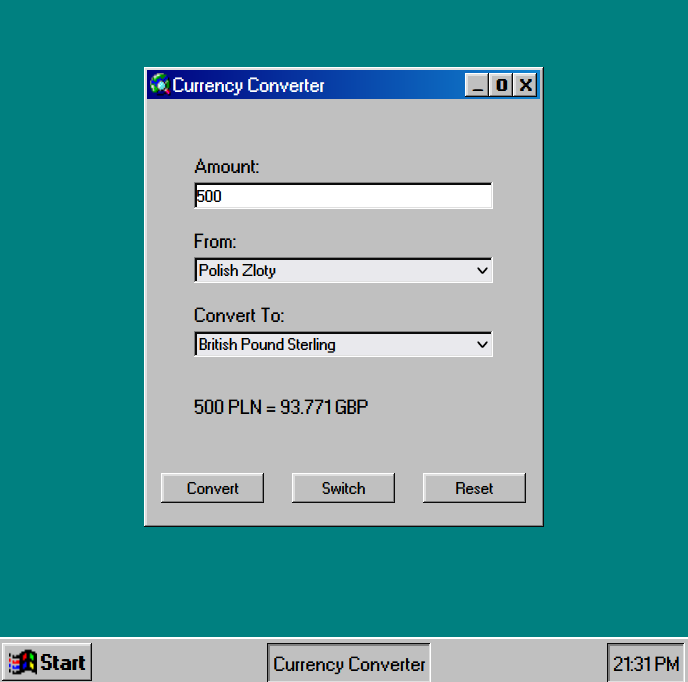

<h1>
Currency Converter 💷
</h1>

---

### App Info

An app which uses an API to fetch latest currency conversion rates, with a dash of nostalgia added in using a Windows 95 GUI!

---

> Deployed here: <a href='https://w95-currency-converter.netlify.app/'>Currency Converter App</a>

---
